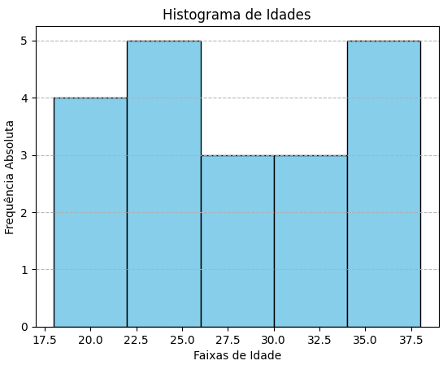

# 📌 Distribuição de Frequência em Python

A distribuição de frequência é uma das ferramentas mais fundamentais da estatística descritiva.
Ela organiza os dados em intervalos (classes), permitindo observar a dispersão, concentração e tendências de forma clara.

---

## 📌 Conteúdo abordado

Neste pequeno projeto, vamos implementar uma tabela de frequência completa em Python, contendo:

- Classes (intervalos)
- Pontos médios
- Frequência absoluta
- Frequência acumulada
- Frequência relativa
- Frequência relativa acumulada
- Histograma visual

---

## 📌 Proposta 

Imagine que temos as idades de 20 pessoas em um grupo.
Listar todos os números não nos ajuda muito a entender o padrão, é aqui que entra a distribuição de frequência.
Ela agrupa as idades em intervalos, mostrando quantas pessoas estão em cada faixa etária.

---

## 📌 Conceitos Teóricos

|Tipo de Frequência	| Símbolo |	Definição |
| ------------------- | ------------------- | ------------------ |
| Classes | k | São intervalos de valores que agrupam os dados. |
| Pontos médios | pm | Valores que representam o centro do intervalo das classes. |
| Frequência Absoluta |	f |	Número de vezes que um valor aparece no conjunto de dados. |
| Frequência Acumulada |	F |	Soma acumulada das frequências absolutas até um determinado valor. |
| Frequência Relativa | (%)	f%	| Percentual que representa a proporção de cada valor em relação ao total de observações. |
| Frequência Relativa Acumulada | (%)	F% |	Soma acumulada dos percentuais até aquele valor. |

Essas medidas são amplamente utilizadas em análises exploratórias de dados e visualização estatística.

---

## 📌 Dustribuição de frequência do projeto

| id | Classes |	Ponto_Médio |	Freq_Absoluta |	Freq_Acumulada |	Freq_Relativa |	Freq_Relativa_Acumulada |
| -- | ------- | ------------ | --------------- | ---------------- | -------------- | ------------------------- |
| 0 |	18-22 | 20.0 |	4 | 4	| 0.20 % | 0.20 % |
| 1 | 22-26 | 24.0 |	5 | 9	| 0.25 % | 0.45 % |
| 2 | 26-30 | 28.0 |	3 | 12| 0.15 % | 0.60 % |
| 3 | 30-34 | 32.0 |	3 | 15| 0.15 % | 0.75 % |
| 4 | 34-38	| 36.0 |	5 | 20| 0.25 % | 1.00 % |

---

## 📌 Histograma



---

## 📌 Pré-requisitos
- Python 3.x
- Biblioteca Pandas
- Biblioteca numpy
- Biblioteca matplotlib

---

## 📌 Como usar  
1. Clone o repositório ou baixe o notebook.  
```
   git clone https://github.com/jcarlossc/python-frequency-distribution.git
   cd python-frequency-distribution
```

## 📌 Contribuições

Se quiser contribuir:
1. Faça um fork deste repositório
2. Crie uma branch para sua feature ou correção (git checkout -b minha-feature)
3. Faça commits descritos claramente
4. Submeta um Pull Request

---

## 📌 Licença
Este projeto está licenciado sob a MIT License.

---

## 📌 Contatos
📌Autor: Carlos da Costa<br>
📌Recife, PE - Brasil<br>
📌Telefone: +55 81 99712 9140<br>
📌Telegram: @jcarlossc<br>
📌Blogger linguagem R: [https://informaticus77-r.blogspot.com/](https://informaticus77-r.blogspot.com/)<br>
📌Blogger linguagem Python: [https://informaticus77-python.blogspot.com/](https://informaticus77-python.blogspot.com/)<br>
📌Email: jcarlossc1977@gmail.com<br>
📌Portfólio em construção: https://portfolio-carlos-costa.netlify.app/<br>
📌LinkedIn: https://www.linkedin.com/in/carlos-da-costa-669252149/<br>
📌GitHub: https://github.com/jcarlossc<br>
📌Kaggle: https://www.kaggle.com/jcarlossc/  
📌Twitter/X: https://x.com/jcarlossc1977

---

